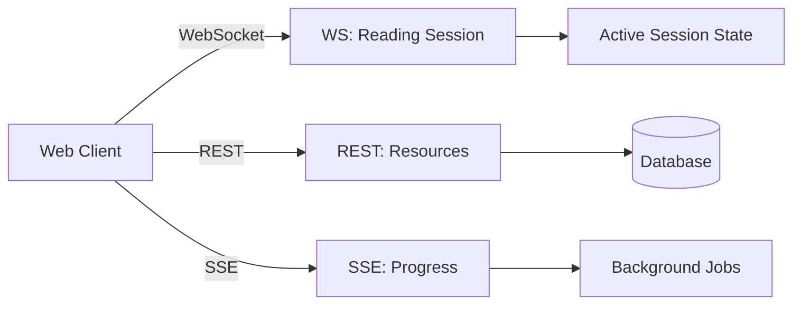
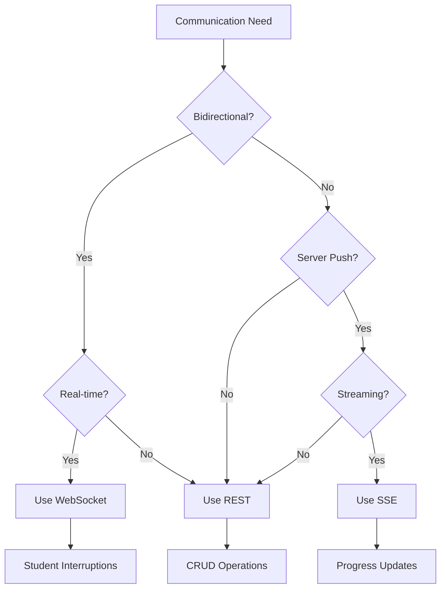

# Communication Patterns in ReaderAI

## Overview

ReaderAI uses three distinct communication patterns, each chosen for specific use cases based on their strengths. This document explains when and why to use WebSockets, Server-Sent Events (SSE), or REST APIs.

## Communication Pattern Decision Matrix

| Pattern       | Use When                                                                                                                   | Don't Use When                                                                        | ReaderAI Examples                                                                   |
| ------------- | -------------------------------------------------------------------------------------------------------------------------- | ------------------------------------------------------------------------------------- | ----------------------------------------------------------------------------------- |
| **WebSocket** | • Bidirectional real-time needed<br>• Low latency critical<br>• Server needs to push events<br>• Maintaining session state | • Simple request/response<br>• Unidirectional data flow<br>• Infrequent updates       | • Student interruptions<br>• Reading state sync<br>• Live checkpoints               |
| **SSE**       | • Server-to-client streaming<br>• Long-running operations<br>• Progress updates<br>• Event notifications                   | • Client needs to send data<br>• Binary data transfer<br>• Complex bidirectional flow | • TTS audio generation progress<br>• Bulk analysis results<br>• Progress indicators |
| **REST**      | • CRUD operations<br>• Stateless requests<br>• Cacheable responses<br>• File uploads/downloads                             | • Real-time updates needed<br>• Long-polling scenarios<br>• Streaming data            | • User profiles<br>• Story library<br>• Historical reports                          |

## WebSockets in ReaderAI

### When to Use WebSockets

WebSockets are our choice for **interactive reading sessions** where:

1. **Instant Bidirectional Communication**: Student can interrupt at any moment
2. **Server-Initiated Events**: Comprehension checkpoints triggered by backend
3. **State Synchronization**: Multiple clients need consistent view
4. **Low Latency Critical**: Kids won't tolerate delays

### WebSocket Message Patterns

```typescript
// Client-initiated interruption
→ { type: 'VOCABULARY_QUESTION', word: 'ephemeral', context: '...' }
← { type: 'PAUSE_AUDIO' }
← { type: 'VOCABULARY_RESPONSE', definition: '...', examples: [...] }
→ { type: 'RESUME_READING' }

// Server-initiated checkpoint
← { type: 'CHECKPOINT_UPCOMING', atWord: 150 }
← { type: 'PAUSE_FOR_CHECKPOINT', question: '...' }
→ { type: 'CHECKPOINT_ANSWER', answer: 'B' }
← { type: 'CHECKPOINT_RESULT', correct: true }
```

### WebSocket Anti-Patterns

DON'T use WebSockets for:

- Fetching story content (use REST)
- Downloading audio files (use REST/HTTP)
- User authentication (use REST)
- File uploads (use REST)

## Server-Sent Events (SSE) in ReaderAI

### When to Use SSE

SSE is perfect for **server-to-client streaming** where:

1. **Unidirectional Flow**: Server pushes, client listens
2. **Progress Updates**: Long-running operations
3. **Event Streams**: Multiple related events
4. **Automatic Reconnection**: Built-in resilience

### SSE Use Cases

```typescript
// TTS Generation Progress
source.onmessage = (event) => {
  const data = JSON.parse(event.data);
  switch (data.type) {
    case "GENERATION_STARTED":
      showSpinner();
      break;
    case "CHUNK_READY":
      updateProgress(data.progress);
      break;
    case "GENERATION_COMPLETE":
      loadAudio(data.audioUrl);
      break;
  }
};

// Batch Analysis Results
// Server analyzes entire book, streams results per chapter
eventSource.onmessage = (event) => {
  const chapter = JSON.parse(event.data);
  updateChapterDifficulty(chapter.id, chapter.metrics);
};
```

### SSE Anti-Patterns

DON'T use SSE for:

- Bidirectional communication (use WebSocket)
- Binary data (use REST with streaming)
- Infrequent updates (use REST polling)
- Client-initiated flows (use REST)

## REST APIs in ReaderAI

### When to Use REST

REST remains ideal for **resource-based operations** where:

1. **Stateless Operations**: Each request is independent
2. **Cacheable**: Responses can be cached
3. **CRUD Patterns**: Create, Read, Update, Delete
4. **Standard HTTP**: Leverages existing infrastructure

### REST Endpoints

```typescript
// Resource-based operations
GET    /api/stories              // List stories
GET    /api/stories/:id          // Get story details
POST   /api/stories/:id/progress // Save reading progress
GET    /api/users/:id/reports    // Get progress reports

// File operations
GET    /api/audio/:storyId       // Download audio file
POST   /api/stories/:id/generate // Request TTS generation

// Settings and configuration
GET    /api/users/:id/preferences
PUT    /api/users/:id/preferences
```

### REST Anti-Patterns

DON'T use REST for:

- Real-time updates (use WebSocket/SSE)
- Long polling (use SSE)
- Maintaining session state (use WebSocket)
- Streaming responses (use SSE)

## Hybrid Approach: Best of All Worlds

ReaderAI uses a **hybrid architecture** that leverages each pattern's strengths:



### Example: Complete Reading Flow

1. **REST**: Load story metadata and content

   ```http
   GET /api/stories/123
   ```

2. **SSE**: Generate TTS if needed, stream progress

   ```typescript
   const eventSource = new EventSource("/api/stories/123/generate-audio");
   eventSource.onmessage = (e) => updateProgress(e.data);
   ```

3. **WebSocket**: Start interactive reading session

   ```typescript
   ws.send({ type: "START_SESSION", storyId: 123 });
   // Bidirectional flow for interruptions, checkpoints, state
   ```

4. **REST**: Save final progress
   ```http
   POST /api/stories/123/progress
   { "wordsRead": 500, "comprehension": 0.85 }
   ```

## Decision Flowchart



## Implementation Guidelines

### WebSocket Guidelines

- Implement heartbeat/ping-pong
- Handle reconnection gracefully
- Use message types/namespacing
- Keep messages small and focused
- Implement proper error handling

### SSE Guidelines

- Use EventSource API
- Implement retry logic
- Send periodic heartbeats
- Structure events with types
- Handle connection drops

### REST Guidelines

- Follow RESTful conventions
- Use appropriate HTTP methods
- Implement proper caching headers
- Use standard status codes
- Version your APIs

## Performance Considerations

| Pattern   | Latency | Throughput | Resource Usage      | Scalability                     |
| --------- | ------- | ---------- | ------------------- | ------------------------------- |
| WebSocket | Lowest  | High       | Medium (persistent) | Horizontal with sticky sessions |
| SSE       | Low     | Medium     | Low (HTTP/2)        | Easy horizontal                 |
| REST      | Medium  | Highest    | Lowest (stateless)  | Easiest horizontal              |

## Security Considerations

### WebSocket Security

- Implement token-based auth on connection
- Validate all messages
- Rate limit by connection
- Use WSS (TLS) always

### SSE Security

- Use authentication tokens in URL or headers
- Implement CORS properly
- Rate limit by IP/user
- Use HTTPS always

### REST Security

- Standard OAuth2/JWT patterns
- CORS configuration
- Rate limiting by endpoint
- HTTPS mandatory

## Conclusion

Choose the right tool for the job:

- **WebSocket**: Interactive, bidirectional, real-time sessions
- **SSE**: Server-driven updates and progress streaming
- **REST**: Everything else - the reliable workhorse

The key is not picking one pattern for everything, but using each where it shines. ReaderAI's hybrid approach ensures optimal user experience while maintaining clean architecture.
