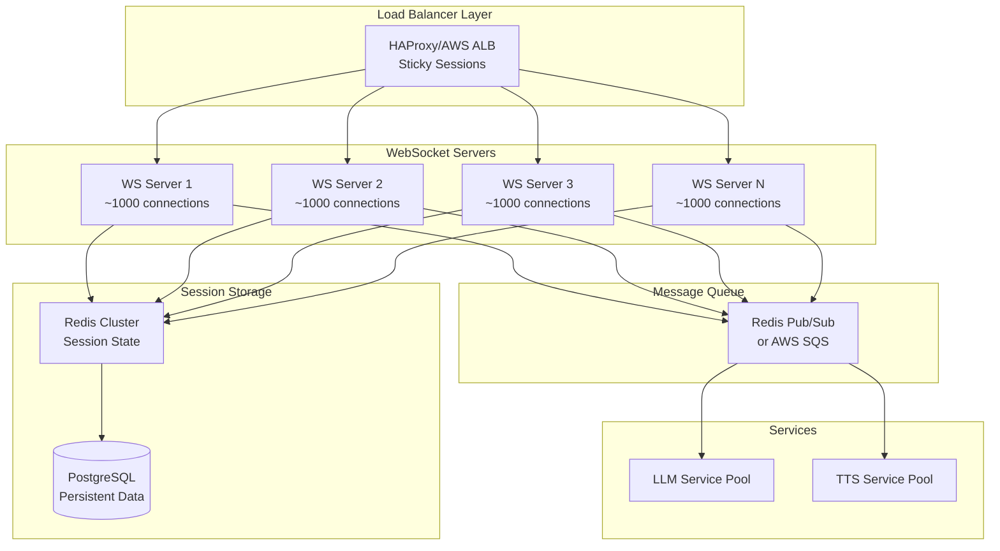

# Scaling WebSockets for ReaderAI

## Target Scale: Thousands of Concurrent Students

ReaderAI is designed to scale to thousands (or tens of thousands) of concurrent reading sessions. Each student maintains their own WebSocket connection for real-time interactions.

## Scaling Architecture



## Key Scaling Strategies

### 1. Connection Distribution

**Per Server Capacity**

- Target: ~1,000 WebSocket connections per server
- Memory: ~1MB per connection (1GB per 1,000 connections)
- CPU: Minimal per idle connection
- Bandwidth: Variable based on activity

**Horizontal Scaling**

- 3,000 students = 3 servers minimum
- 30,000 students = 30 servers minimum
- Add servers dynamically based on load

### 2. Load Balancing

**Sticky Sessions Required**

```nginx
# Example HAProxy configuration
backend websocket_servers
    balance leastconn
    stick-table type string len 32 size 100k expire 30m
    stick on cookie(session_id)

    server ws1 10.0.1.10:8000 check
    server ws2 10.0.1.11:8000 check
    server ws3 10.0.1.12:8000 check
```

**Why Sticky Sessions?**

- WebSocket connections are stateful
- Reconnections must return to same server
- Simplifies session state management

### 3. Session State Management

**Redis for Fast Access**

```python
# Session state in Redis
session_key = f"session:{session_id}"
session_data = {
    "student_id": "student-123",
    "book_id": "cat-in-hat",
    "word_index": 150,
    "audio_timestamp": 45.2,
    "server_id": "ws-server-3",
    "last_active": datetime.utcnow()
}
redis.setex(session_key, 3600, json.dumps(session_data))
```

**Benefits**

- Sub-millisecond access times
- Shared across servers for failover
- TTL for automatic cleanup
- Supports millions of sessions

### 4. Message Queue Architecture

**Decoupled Processing**

```python
# WebSocket server publishes to queue
async def handle_student_question(websocket, message):
    # Quick acknowledgment
    await websocket.send(json.dumps({
        "type": "INTERRUPTION_ACKNOWLEDGED"
    }))

    # Queue for processing
    await redis.publish("student_questions", json.dumps({
        "session_id": session_id,
        "question": message["payload"]["questionText"],
        "context": message["payload"]["context"]
    }))
```

**LLM Service Consumes**

```python
# Separate service handles LLM calls
async def process_questions():
    pubsub = redis.pubsub()
    pubsub.subscribe("student_questions")

    for message in pubsub.listen():
        question_data = json.loads(message["data"])
        response = await llm.answer_question(question_data)

        # Send back through WebSocket server
        await redis.publish(f"responses:{question_data['session_id']}",
                          json.dumps(response))
```

### 5. Resource Optimization

**Connection Pooling**

```python
# Reuse database connections
db_pool = asyncpg.create_pool(
    min_size=10,
    max_size=100,
    max_queries=50000,
    max_inactive_connection_lifetime=300
)

# Reuse Redis connections
redis_pool = aioredis.ConnectionPool(
    max_connections=50,
    decode_responses=True
)
```

**Memory Management**

- Use binary protocols where possible
- Compress large messages
- Paginate history queries
- Clear inactive session data

### 6. Monitoring and Auto-scaling

**Key Metrics**

```yaml
# Prometheus metrics
websocket_connections_total: 3247
websocket_connections_per_server:
  ws-1: 1082
  ws-2: 1090
  ws-3: 1075

message_queue_depth: 45
llm_response_time_p95: 1.2s
memory_usage_per_connection: 0.98MB
```

**Auto-scaling Rules**

```yaml
# Kubernetes HPA example
apiVersion: autoscaling/v2
kind: HorizontalPodAutoscaler
metadata:
  name: websocket-servers
spec:
  scaleTargetRef:
    apiVersion: apps/v1
    kind: Deployment
    name: websocket-server
  minReplicas: 3
  maxReplicas: 50
  metrics:
    - type: Resource
      resource:
        name: cpu
        target:
          type: Utilization
          averageUtilization: 70
    - type: Pods
      pods:
        metric:
          name: websocket_connections
        target:
          type: AverageValue
          averageValue: "1000"
```

## Cost Optimization

### Per-Student Costs (at scale)

**Infrastructure**

- WebSocket server: ~$0.001/student/month
- Redis cache: ~$0.0005/student/month
- Load balancer: ~$0.0002/student/month
- **Total infra: ~$0.002/student/month**

**Services**

- LLM calls: Variable based on questions
- TTS generation: One-time per book
- Storage: Minimal (session data)

### Optimization Strategies

1. **Regional Deployment**
   - Deploy closer to users
   - Reduce latency and bandwidth costs
   - Use CDN for static assets

2. **Efficient Protocols**
   - Use MessagePack instead of JSON
   - Enable WebSocket compression
   - Batch small messages

3. **Smart Caching**
   - Cache LLM responses for common questions
   - Pre-generate TTS for popular books
   - Edge cache for static content

## Failover and Reliability

### Server Failure Handling

```typescript
// Client-side reconnection
class ResilientWebSocket {
  private reconnectDelay = 1000;
  private maxDelay = 30000;

  async connect() {
    try {
      this.ws = new WebSocket(this.url);
      this.setupHandlers();
    } catch (error) {
      await this.scheduleReconnect();
    }
  }

  private async scheduleReconnect() {
    await sleep(this.reconnectDelay);
    this.reconnectDelay = Math.min(this.reconnectDelay * 1.5, this.maxDelay);
    this.connect();
  }
}
```

### Session Recovery

```python
# Server-side session recovery
async def handle_reconnection(websocket, session_id):
    # Restore from Redis
    session_data = await redis.get(f"session:{session_id}")
    if session_data:
        session = json.loads(session_data)

        # Send state snapshot
        await websocket.send(json.dumps({
            "type": "SESSION_RESTORED",
            "payload": {
                "wordIndex": session["word_index"],
                "audioTimestamp": session["audio_timestamp"],
                "pendingMessages": await get_pending_messages(session_id)
            }
        }))
```

## Real-World Examples

### 10,000 Concurrent Students

**Infrastructure Required**

- 10 WebSocket servers (c5.xlarge)
- 1 Redis cluster (3 nodes, cache.r6g.large)
- 1 Load balancer (ALB)
- 3 LLM service instances
- 2 TTS service instances

**Monthly Costs (AWS)**

- WebSocket servers: $760
- Redis cluster: $220
- Load balancer: $20
- **Total: ~$1,000/month ($0.10/student/month)**

### Peak Load Handling

**School Day Pattern**

```
6 AM:    500 students
8 AM:  5,000 students (morning reading)
10 AM: 3,000 students
12 PM: 1,000 students (lunch)
2 PM:  4,000 students (afternoon reading)
4 PM:  1,500 students (after school)
6 PM:    800 students (homework)
```

**Auto-scaling Response**

- Scale up before 8 AM rush
- Scale down during lunch
- Pre-warm servers for predictable patterns
- Keep minimum capacity for responsiveness

## Summary

ReaderAI's architecture scales efficiently to thousands of concurrent students by:

1. **Horizontal scaling** - Add servers as needed
2. **Efficient state management** - Redis for speed
3. **Decoupled processing** - Queue heavy operations
4. **Smart load balancing** - Sticky sessions for WebSockets
5. **Cost optimization** - ~$0.10/student/month at scale
6. **Reliable failover** - Automatic reconnection and recovery

The system can handle 3,000 students on a modest infrastructure and scale to 30,000+ by simply adding more servers. The architecture supports global deployment for millions of students.
